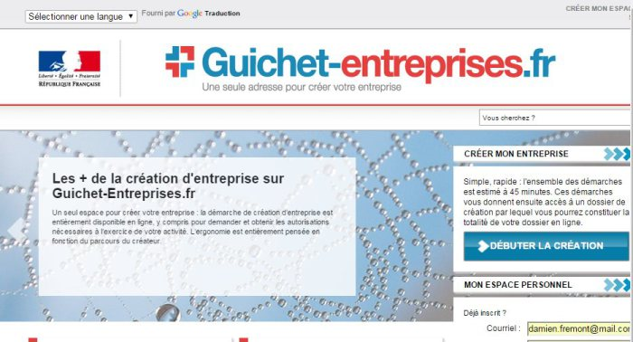
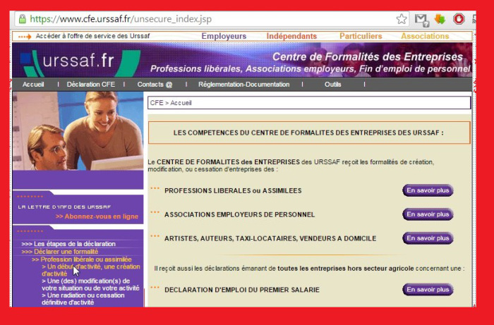
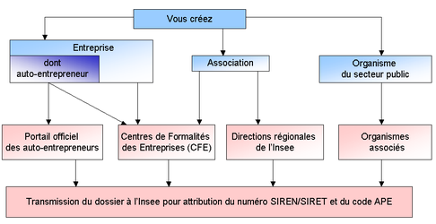
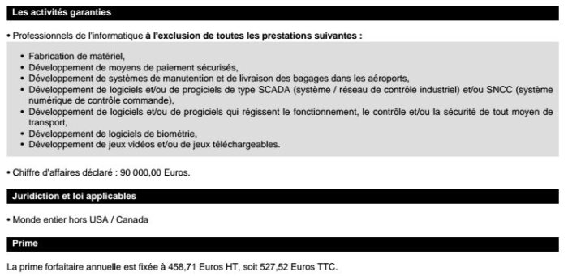

Développeur freelance en 2015 : se lancer (1/3)
======
 

 
Ceci est mon retour d’expérience du passage de salarié en SSII vers développeur freelance après deux premiers mois d’activité.
 

 
# Etapes
 
## 1. Avant de se lancer
 
## Evaluer sa motivation
 
J’y gagne quoi ? Un revenu en plus, de l’indépendance dans le choix des missions, étendre son activité, des préavis de mission plus courts (attention ça marche dans les 2 sens), faire passer une partie de votre logement et matériel informatique en charges.
 
J’y perd quoi ? Parfois une bonne SSII. Le CDI, et tout ce qui va avec (faire un emprunts, changer de logement logement quand on est locataire en région Parisienne). Les congés payés et maladie.
 
Exemple : Dans mon cas, je ne voyais pas bien ce que m’apportait une structure SSII avec un CE dont je profite peu, une promotion interne faible, une communauté parfois inexistante et un salaire parfois très éloigné du taux journalier. Par contre, devenir plus libre dans le choix des missions, sans la pression d’un commercial avec l’inter-contrat, ainsi qu’élargir mon activité à un peu de formation en annexe m’a motivé …mais je voulais aussi changer d’appart dans les prochains :-S
 
j’ai changé d’appartement avant de démissionner (coût : 1000€), puis démissionné …avec un préavis de 3 mois (yeurk!)
 

 

 
## Estimer son futur revenu
 
C’est important pour ne pas avoir de fausse joie et savoir à quoi s’attendre au moment de payer l’impôt.
 
[http://tarifs.freelance-info.fr/developpeur/](http://tarifs.freelance-info.fr/developpeur/)
http://tarifs.freelance-info.fr/developpeur/
 
Voici une formule toute faite pour le net de l’année (Merci Didier) : (((<jours ouvrés> – <congés>)*<taux journalier> – 12*<frais mensuel>)*0,75)/12 = net mensuel
 
Le chiffre d’affaire est plus simple : (<jours ouvrés> – <congés>)*<taux journalier> = CA
 
Exemple : j’ai calculé mon revenu pour un dev Java de 5 ans d’expérience (((218-40)*510-12*1000)*0,75)/12 = 4900€/m soit un net de 59000 €/an et un CA de (218-40)*510 = 90780€/an.
 
## Préparer sa création
 
Il faut se prévoir un peu de liquidité, en plus de ce qu’exige votre niveau de vie actuel. Ainsi, il y a aura inter-contrat, les différentes caisses qui vont commencer à vous ponctionner dès le premier trimestre avant même que vous ayez des revenus (impôts, URSSAF, RSI, retraite) et votre 1er client qui vous paiera à 60 jours la plupart du temps.
 
Exemple : On m’avait conseillé de prévoir de quoi tenir plusieurs mois à raison de 2-3000€ par mois (pour Paris, avec un loyer exorbitant). J’ai gardé de coté de quoi tenir plusieurs mois (15000€).
 
## 2. La création 1/2 : immatriculation
 
## Quelle forme choisir ?
 
Dans mon cas pour un simple développeur freelance chez un client, je fais parti des travailleurs indépendants / liberaux exerçant une activité de conseil. Le simple statut EI (Entreprise individuelle) suffit et certains commencent même auto-entrepreneur la 1ere année. C’est le gouv qui le dit : http://vosdroits.service-public.fr/professionnels-entreprises/F23458.xhtml
 
## Comment créer ?
 
Cela peut aussi maintenant se faire en ligne, il faudra ici inscrire principalement :
 
– vos informations personnelles (nom, prénom, adresse etc.)
– la nature de vos activités (ex : Développeur web) et le début de votre activité
– s’il s’agit d’une création d’activité ou une reprise
– votre numéro de sécurité sociale
– des informations de contact (téléphone, mail etc.)
 
La seule subtilité concerne les options fiscales. Il s’agit simplement du régime dont vous désirez bénéficier. En clair, vous devrez choisir le Régime Spécial BNC (appelé aussi Micro BNC) et inscrire « Réel simplifié ».
 
[http://www.guichet-entreprises.fr/](http://www.guichet-entreprises.fr/)
http://www.guichet-entreprises.fr/
 

 

 
(évitez le vieux site des URSSAF, qui fait la même chose en moins clair …j’ai passé 1h sur ce truc, qui n’a pas fonctionné au final)
 

 

 
## 3. La paperasse à conserver
 
TOUT est à conserver !
 
[http://www.insee.fr/fr/service/default.asp?page=entreprises/sirene/immatriculation.htm](http://www.insee.fr/fr/service/default.asp?page=entreprises/sirene/immatriculation.htm)
Comme l’explique l’INSEE ici http://www.insee.fr/fr/service/default.asp?page=entreprises/sirene/immatriculation.htm, il va se passer ça en environ 1 semaine. Au delà, contactez-les.
 

 

 
Vous allez recevoir dans l’ordre :
 
* inscription INSEE (SIREN et SIRET, 1 semaine)
* immatriculation RSI (SECU, 1 mois)
* immatriculation URSSAF (SECU, 1 mois) …mais parfois non
* identifiants RAM (Retraite, 2 mois)
 
Exemple : allez faire un tour sur le net pour vérifier votre société.
 
[https://www.infogreffe.fr/societes/entreprise-societe/804913630-fremont-damien-80491363000013.html](https://www.infogreffe.fr/societes/entreprise-societe/804913630-fremont-damien-80491363000013.html)
https://www.infogreffe.fr/societes/entreprise-societe/804913630-fremont-damien-80491363000013.html
 
## 4. La paperasse à faire de suite : assurance pro, impôts, AGA
 
## Responsabilité Civile Professionnelle
 
Vous devez souscrire immédiatement à une assurance pro (Responsabilité Civile Professionnelle). Les SSII et les clients vont vous la demander, autant qu’elle soit prête pour commencer la mission. Attention à bien choisir Professionnel de l’informatique et un chiffre d’affaire proche du CA calculé précédemment.
 
Exemple : j’ai pris une assurance pro chez Hiscox (pour la seule raison que je pouvais tout faire en ligne et avoir un prélèvement mensuel de suite).
 

 

 
## Cotisation CFE (impôts, 3 mois)
 
C’est le bazar, d’autres l’expliquent mieux que moi.
 
[http://autoentrepreneurinfo.com/que-faire-avec-la-declaration-initiale-de-cfe-2014](http://autoentrepreneurinfo.com/que-faire-avec-la-declaration-initiale-de-cfe-2014)
http://autoentrepreneurinfo.com/que-faire-avec-la-declaration-initiale-de-cfe-2014
 
[http://www.planete-auto-entrepreneur.com/autoentrepreneur/foire-aux-questions/2348-je-viens-de-creer-mon-auto-entreprise-jai-recu-un-formulaire-de-declaration-initiale-de-cfe-nd1447-c-est-ce-normal-comment-la-renseigner-.html](http://www.planete-auto-entrepreneur.com/autoentrepreneur/foire-aux-questions/2348-je-viens-de-creer-mon-auto-entreprise-jai-recu-un-formulaire-de-declaration-initiale-de-cfe-nd1447-c-est-ce-normal-comment-la-renseigner-.html)
http://www.planete-auto-entrepreneur.com/autoentrepreneur/foire-aux-questions/2348-je-viens-de-creer-mon-auto-entreprise-jai-recu-un-formulaire-de-declaration-initiale-de-cfe-nd1447-c-est-ce-normal-comment-la-renseigner-.html
 
[https://www.evoportail.fr/actualites/2013/12/19/declaration-cfe-2014-auto-entrepreneur/](https://www.evoportail.fr/actualites/2013/12/19/declaration-cfe-2014-auto-entrepreneur/)
https://www.evoportail.fr/actualites/2013/12/19/declaration-cfe-2014-auto-entrepreneur/
 
## Souscrire à une AGA dans les premiers mois !!!
 
* Votre inscription à titre individuel ou de groupement d’exercice doit être effectuée dans les dans les cinq mois du début d’activité,
* l’adhésion s’effectue alors que vous exercer déjà votre activité, elle doit être réalisée au plus tard à la date 31 mai (31 mars antérieurement)
 
## Et le reste
 
Vous allez recevoir dans l’ordre et remplir (attention aux dates limites car parfois à la réception il ne reste que 15 jours) :
 
* questionnaire DGFIP (impôts, 1 semaine)
* cotisation URSSAF (SECU, 1 mois)
* avis d’acompte TVA (impôts, 2 mois)
 
## 5. La paperasse à faire plus tard : impôts  en ligne, mutuelle, carte vitale, prévoyance
 
## Impôts en ligne
 
Pensez à activer votre compte en ligne sur les impôts pour professionnels. En effet, la procédure est simple, mais il faut attendre de recevoir un code d’activation par courrier (1 semaine). A faire avant d’en avoir besoin donc.
 
[http://www.impots.gouv.fr/portal/static/pro/pro.html](http://www.impots.gouv.fr/portal/static/pro/pro.html)
http://www.impots.gouv.fr/portal/static/pro/pro.html
 
## Souscrire à une mutuelle
 
A choisir en fonction de vos besoins (on a pas les mêmes besoin à 25 ans en pleine santé qu’à 50 ans avec le dos, les yeux et les dents pourries). Si possible en loi Madelin, pour également la déduire des charges.
 
## Mettre à jour de votre carte vitale
 
Et oui, vous avez changé de SECU ! A faire en pharmacie, comme d’habitude sur les bornes dédiées.
 
## Prendre une prévoyance (facultatif)
 
Et oui, vous n’avez pas d’arrêt maladie donc en cas de pépin
 
Exemple : j’ai pris le minimum, une mutuelle. On verra bien après si l’activité persiste pour prendre la prévoyance retraite (si mon activité persiste et si je choisis de ne pas la faire par capitalisation)
 
# Conclusion
 
C’était la partie énervante du projet. La suite dans “Développeur freelance en 2015 : trouver une mission (2/3)”.
 
[Développeur freelance en 2015 : la routine, les missions (2/3)](http://damienfremont.com/2015/12/03/developpeur-freelance-en-2015-la-routine-les-missions-23/)
La suite ici Développeur freelance en 2015 : la routine, les missions (2/3).
 
# Références
 
[Didier Giovanetti](http://www.viadeo.com/fr/profile/didier.giovanetti)
Merci à Didier Giovanetti pour ses conseils (dev freelance également).
 
[http://fr.viadeo.com/fr/profile/didier.giovanetti](http://fr.viadeo.com/fr/profile/didier.giovanetti)
http://fr.viadeo.com/fr/profile/didier.giovanetti
 
[http://www.java-freelance.fr/freelance/bilan#more-479](http://www.java-freelance.fr/freelance/bilan#more-479)
http://www.java-freelance.fr/freelance/bilan#more-479
 
[http://www.java-freelance.fr/freelance/comment-gagner-6000e-par-mois-en-etant-developpeur](http://www.java-freelance.fr/freelance/comment-gagner-6000e-par-mois-en-etant-developpeur)
http://www.java-freelance.fr/freelance/comment-gagner-6000e-par-mois-en-etant-developpeur
 
[http://blog-du-consultant.fr/les-septs-galeres-du-consultant-independant/](http://blog-du-consultant.fr/les-septs-galeres-du-consultant-independant/)
http://blog-du-consultant.fr/les-septs-galeres-du-consultant-independant/
 
## 
 
 
## Origin
[https://damienfremont.com/2015/03/16/developpeur-freelance-en-2015-se-lancer-13/](https://damienfremont.com/2015/03/16/developpeur-freelance-en-2015-se-lancer-13/)
 
