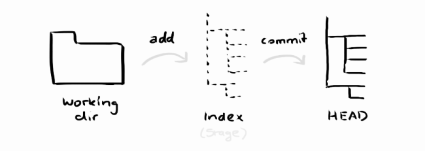

Git – The Simple Guide
======
 

 
[git – the simple guide](http://rogerdudler.github.io/git-guide/)
Because I always forget git commands… source here: git – the simple guide (it’s better)
 

 

 
just a simple guide for getting started with git. no deep shit
 
## Setup
 
* Download git for OSX
* Download git for Windows
* Download git for Linux
 
## Create a new repository
 
create a new directory, open it and perform a
 
to create a new git repository.
 
## Checkout a repository
 
create a working copy of a local repository by running the command
 
when using a remote server, your command will be
 
## Workflow
 
your local repository consists of three “trees” maintained by git. the first one is your Working Directory which holds the actual files. the second one is the Index which acts as a staging area and finally the HEAD which points to the last commit you’ve made.
 

 

 
## Add & commit
 
You can propose changes (add it to the Index) using
 
This is the first step in the basic git workflow. To actually commit these changes use
 
Now the file is committed to the HEAD, but not in your remote repository yet.
 
## Pushing changes
 
Your changes are now in the HEAD of your local working copy. To send those changes to your remote repository, execute
 
Change master to whatever branch you want to push your changes to.
 
If you have not cloned an existing repository and want to connect your repository to a remote server, you need to add it with
 
Now you are able to push your changes to the selected remote server
 
## Branching
 
Branches are used to develop features isolated from each other. The master branch is the “default” branch when you create a repository. Use other branches for development and merge them back to the master branch upon completion.
create a new branch named “feature_x” and switch to it using
 
switch back to master
 
and delete the branch again
 
a branch is not available to others unless you push the branch to your remote repository
 
## Update & merge
 
to update your local repository to the newest commit, execute
 
in your working directory to fetch and merge remote changes.
to merge another branch into your active branch (e.g. master), use
 
in both cases git tries to auto-merge changes. Unfortunately, this is not always possible and results in conflicts. You are responsible to merge those conflicts manually by editing the files shown by git. After changing, you need to mark them as merged with
 
before merging changes, you can also preview them by using
 
## Tagging
 
it’s recommended to create tags for software releases. this is a known concept, which also exists in SVN. You can create a new tag named 1.0.0 by executing
 
the 1b2e1d63ff stands for the first 10 characters of the commit id you want to reference with your tag. You can get the commit id by looking at the…
 
## Log
 
in its simplest form, you can study repository history using..
 
You can add a lot of parameters to make the log look like what you want. To see only the commits of a certain author:
 
To see a very compressed log where each commit is one line:
 
Or maybe you want to see an ASCII art tree of all the branches, decorated with the names of tags and branches:
 
See only which files have changed:
 
These are just a few of the possible parameters you can use.
 
## Replace local changes
 

 
In case you did something wrong, which for sure never happens, you can replace local changes using the command
 
this replaces the changes in your working tree with the last content in HEAD. Changes already added to the index, as well as new files, will be kept.
 
If you instead want to drop all your local changes and commits, fetch the latest history from the server and point your local master branch at it like this
 
## Useful hints
 
built-in git GUI
 
use colorful git output
 
show log on just one line per commit
 
use interactive adding
 
## Links & resources
 
## graphical clients
 
* GitX (L) (OSX, open source)
* Tower (OSX)
* Source Tree (OSX & Windows, free)
* GitHub for Mac (OSX, free)
* GitBox (OSX, App Store)
 
## guides
 
* Git Community Book
* Pro Git
* Think like a git
* GitHub Help
* A Visual Git Guide
 
## get help
 
* Git User Mailing List
* #git on irc.freenode.net
 
# References
 
[http://rogerdudler.github.io/git-guide/](http://rogerdudler.github.io/git-guide/)
http://rogerdudler.github.io/git-guide/
 
 
[https://damienfremont.com/2015/09/01/git-the-simple-guide/](https://damienfremont.com/2015/09/01/git-the-simple-guide/)
 
