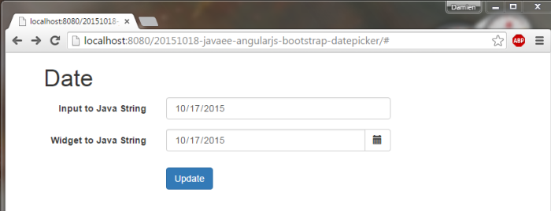
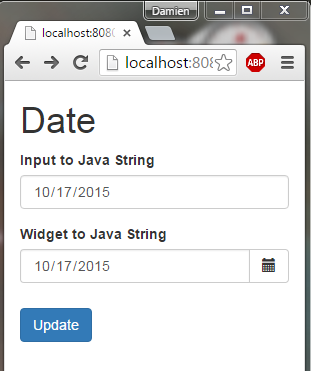
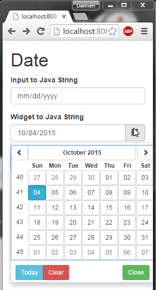
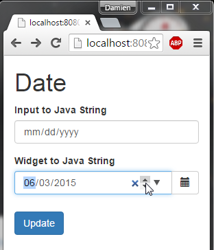
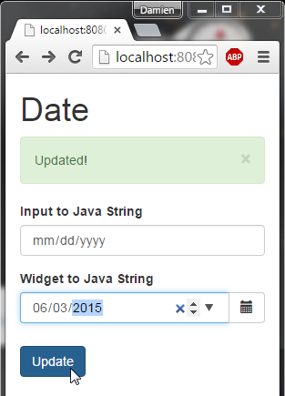
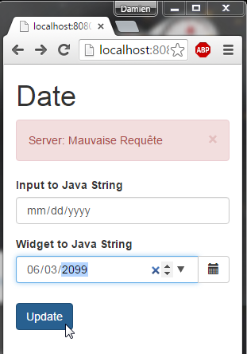
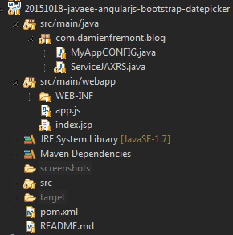
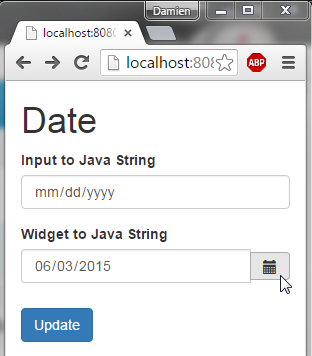

JavaEE AngularJS Bootstrap: Date Picker
======
 

 
Build a DatePicker with AngularUI Widget from Bootstrap and post it to a REST Java server with Jersey and Bean Validation.
 

 
# Demo
 
[http://localhost:8080/20151018-javaee-angularjs-bootstrap-datepicker/](http://localhost:8080/20151018-javaee-angularjs-bootstrap-datepicker/)
http://localhost:8080/20151018-javaee-angularjs-bootstrap-datepicker/
 
A responsive layout switching from large to small screen.
 

 

 

 

 
A post to Java Server with transformation from Javascript Date to JSON String.
 

 

 
A DatePicker widget.
 

 

 

 

 

 

 
And back end validation on futur Date.
 

 

 

 

 
# Source
 

 

 
 
 
MyAppCONFIG.java
 
```java
package com.damienfremont.blog;
 
import java.util.HashSet;
import java.util.Set;
import javax.ws.rs.core.Application;
 
public class MyAppCONFIG extends Application {
 
  @Override
  public Set<Class<?>> getClasses() {
    Set<Class<?>> s = new HashSet<Class<?>>();
    s.add(ServiceJAXRS.class);
    return s;
  }
}
```
 
ServiceJAXRS.java
 
```java
package com.damienfremont.blog;
 
import java.io.Serializable;
import java.util.Date;
 
import javax.validation.Valid;
import javax.validation.constraints.NotNull;
import javax.validation.constraints.Past;
import javax.validation.executable.ValidateOnExecution;
import javax.ws.rs.Consumes;
import javax.ws.rs.GET;
import javax.ws.rs.POST;
import javax.ws.rs.Path;
import javax.ws.rs.Produces;
import javax.ws.rs.core.MediaType;
 
 
@Path("/")
public class ServiceJAXRS {
   
  // READ
  @GET
  @Produces(MediaType.APPLICATION_JSON)
  public Model get() {
    return data;
  }
   
  // UPDATE
  @POST
  @Consumes(MediaType.APPLICATION_JSON)
  @ValidateOnExecution
  public void post(@Valid Model data) {
    this.data = data;
  }
   
  // MODEL
  static class Model implements Serializable {
    private static final long serialVersionUID = 9167120287441116359L;
    @Past
    public Date testDateInput;
    @Past
    public Date testDatePicker;
  }
   
  // MOCK
  static Model data;
  static {
    data = new Model();
    data.testDateInput= new Date();
    data.testDatePicker= new Date();
  }
}
```
 
web.xml
 
```xml
<web-app xmlns="http://xmlns.jcp.org/xml/ns/javaee"
         xmlns:xsi="http://www.w3.org/2001/XMLSchema-instance"
         xsi:schemaLocation="http://xmlns.jcp.org/xml/ns/javaee
     http://xmlns.jcp.org/xml/ns/javaee/web-app_3_1.xsd"
         version="3.1">
 
  <servlet>
    <servlet-name>REST</servlet-name>
    <servlet-class>org.glassfish.jersey.servlet.ServletContainer</servlet-class>
    <init-param>
      <param-name>javax.ws.rs.Application</param-name>
      <param-value>com.damienfremont.blog.MyAppCONFIG</param-value>
    </init-param>
    <load-on-startup>1</load-on-startup>
  </servlet>
  <servlet-mapping>
    <servlet-name>REST</servlet-name>
    <url-pattern>/api/*</url-pattern>
  </servlet-mapping>
 
  <servlet>
    <servlet-name>WEBJARS</servlet-name>
    <servlet-class>org.webjars.servlet.WebjarsServlet</servlet-class>
    <init-param>
      <param-name>disableCache</param-name>
      <param-value>true</param-value>
    </init-param>
    <load-on-startup>2</load-on-startup>
  </servlet>
  <servlet-mapping>
    <servlet-name>WEBJARS</servlet-name>
    <url-pattern>/webjars/*</url-pattern>
  </servlet-mapping>
 
</web-app>
```
 
app.js
 
```javascript
'use strict';
 
var myApp = angular.module(
  'myApp',
  [ 'ngAnimate',
    'ui.bootstrap',
    'ngResource']);
 
myApp.controller('AlertCtrl', function($scope) {
  $scope.alerts = [ ];
  $scope.closeAlert = function(index) {
    $scope.alerts.splice(index, 1);
  };
});
 
myApp.factory('Model', function($resource) {
  return $resource('api', {}, {
    get: {
      transformResponse: function(data, headers) {
        // MAP DATES
        var data = angular.fromJson(data);
        data.testDateInput  = data.testDateInput  === null ? null : new Date(data.testDateInput);
        data.testDatePicker = data.testDatePicker === null ? null : new Date(data.testDatePicker);
        return data;
      }
    }
  });
});
 
myApp.controller('DatepickerCtrl', function($scope, Model, $location) {
     
  // READ
  Model.get(function(obj) {
    $scope.model = obj;
  });
   
  // UPDATE
  $scope.update = function() {
    Model.save($scope.model, function(obj) {
      $scope.$parent.alerts.push({type: 'success', msg: 'Updated!'});
    }, function(error) {
      $scope.$parent.alerts.push({type: 'danger', msg: 'Server: '+error.statusText});
    });
  }
   
  // DATEPICKER BUTTON
  $scope.status = { opened: false };
  $scope.open = function($event) {
    $scope.status.opened = true;
  }; 
 
});
```
 
index.jsp
 
```xml
<!DOCTYPE html> <!-- DON'T FORGET DOCTYPE OR THERE WILL BE .btn CLASS HEIGHT BUGS! https://github.com/twbs/bootstrap/issues/10482 -->
<html ng-app="myApp">
<head>
<!-- LIBS CSS -->
<link rel="stylesheet" href="webjars/bootstrap/${bootstrap.version}/css/bootstrap.css">
<!-- LIBS JS -->
<script src="webjars/angularjs/${angularjs.version}/angular.js"></script>
<script src="webjars/angularjs/${angularjs.version}/angular-resource.js"></script>
<script src="webjars/angularjs/${angularjs.version}/angular-animate.js"></script>
<script src="webjars/angular-ui-bootstrap/${angular-ui-bootstrap.version}/ui-bootstrap-tpls.js"></script>
<!-- YOUR JS -->
<script src="app.js"></script>
</head>
<body>
  <div class="container" ng-controller="AlertCtrl">
    <h1>Date</h1>
 
    <!-- ALERT -->
    <uib-alert ng-repeat="alert in alerts" type="{{alert.type}}" close="closeAlert($index)">{{alert.msg}}</uib-alert>
 
    <!-- FORM -->
    <form class="form-horizontal" ng-controller="DatepickerCtrl">
 
       <!-- DATE INPUT -->
 
      <div class="form-group">
        <label class="col-sm-3 control-label">Input to Java String</label>
        <div class="col-sm-6">
          <input class="form-control" ng-model="model.testDateInput"
            type="date">
        </div>
      </div>
       
      <!-- DATEPICKER -->
       
      <div class="form-group">
        <label class="col-sm-3 control-label">Widget to Java String</label>
        <div class="col-sm-6">
            <p class="input-group">
              <input class="form-control" ng-model="model.testDatePicker"
                type="date"
                uib-datepicker-popup
                is-open="status.opened"
                datepicker-options="dateOptions"
                date-disabled="disabled(date, mode)"
                close-text="Close" />
              <span class="input-group-btn">
                <button type="button" class="btn btn-default"
                  ng-click="open($event)"><i class="glyphicon glyphicon-calendar"></i>
                </button>
              </span>
            </p>
        </div>
      </div>
       
      <!-- UPDATE -->
      <div class="form-group">
        <div class="col-sm-offset-3 col-sm-9">
          <button type="submit" class="btn btn-primary" ng-click="update()">Update</button>
        </div>
      </div>
    </div>
  </form>
</body>
</html>
```
 
pom.xml
 
```xml
<project xmlns="http://maven.apache.org/POM/4.0.0" xmlns:xsi="http://www.w3.org/2001/XMLSchema-instance"
  xsi:schemaLocation="http://maven.apache.org/POM/4.0.0 http://maven.apache.org/xsd/maven-4.0.0.xsd">
  <modelVersion>4.0.0</modelVersion>
 
  <groupId>com.damienfremont.blog</groupId>
  <artifactId>20151018-javaee-angularjs-bootstrap-datepicker</artifactId>
  <version>0.0.1-SNAPSHOT</version>
  <packaging>war</packaging>
 
  <properties>
    <project.build.sourceEncoding>UTF-8</project.build.sourceEncoding>
    <java.version>7</java.version>
    <jersey.version>2.22.1</jersey.version>
    <angularjs.version>1.4.7</angularjs.version>
    <angular-ui-bootstrap.version>0.14.0</angular-ui-bootstrap.version>
    <bootstrap.version>3.3.5</bootstrap.version>
  </properties>
 
  <dependencies>
 
    <!-- JAVA -->
 
    <dependency>
      <groupId>javax</groupId>
      <artifactId>javaee-api</artifactId>
      <version>7.0</version>
      <scope>provided</scope>
    </dependency>
 
    <dependency>
      <groupId>org.glassfish.jersey.containers</groupId>
      <artifactId>jersey-container-servlet</artifactId>
      <version>${jersey.version}</version>
    </dependency>
    <dependency>
      <groupId>org.glassfish.jersey.media</groupId>
      <artifactId>jersey-media-json-jackson</artifactId>
      <version>${jersey.version}</version>
    </dependency>
    <dependency>
      <groupId>org.glassfish.jersey.ext</groupId>
      <artifactId>jersey-bean-validation</artifactId>
      <version>${jersey.version}</version>
    </dependency>
 
    <!-- WEB -->
 
    <dependency>
      <groupId>org.webjars</groupId>
      <artifactId>webjars-servlet-2.x</artifactId>
      <version>1.1</version>
    </dependency>
 
    <dependency>
      <groupId>org.webjars</groupId>
      <artifactId>angularjs</artifactId>
      <version>${angularjs.version}</version>
    </dependency>
    <dependency>
      <groupId>org.webjars</groupId>
      <artifactId>angular-ui-bootstrap</artifactId>
      <version>${angular-ui-bootstrap.version}</version>
    </dependency>
 
    <dependency>
      <groupId>org.webjars</groupId>
      <artifactId>bootstrap</artifactId>
      <version>${bootstrap.version}</version>
    </dependency>
 
  </dependencies>
 
 
  <build>
    <resources>
      <resource>
        <directory>src/main/webapp</directory>
        <filtering>true</filtering>
        <targetPath>${project.basedir}/target/m2e-wtp/web-resources</targetPath>
        <includes>
          <include>*.jsp</include>
        </includes>
      </resource>
    </resources>
    <plugins>
      <plugin>
        <groupId>org.apache.maven.plugins</groupId>
        <artifactId>maven-war-plugin</artifactId>
        <version>2.6</version>
        <configuration>
          <webResources>
            <resource>
              <directory>src/main/webapp</directory>
              <filtering>true</filtering>
              <includes>
                <include>*.jsp</include>
              </includes>
            </resource>
          </webResources>
        </configuration>
      </plugin>
 
      <plugin>
        <groupId>org.apache.maven.plugins</groupId>
        <artifactId>maven-compiler-plugin</artifactId>
        <version>3.1</version>
        <configuration>
          <source>1.${java.version}</source>
          <target>1.${java.version}</target>
        </configuration>
      </plugin>
 
    </plugins>
  </build>
</project>
```
 
# BUG: DatePicker Button Height
 
Don’t forget <!DOCTYPE html> or there will be .btn CLass height bugs!
 
[https://github.com/twbs/bootstrap/issues/10482](https://github.com/twbs/bootstrap/issues/10482)
https://github.com/twbs/bootstrap/issues/10482
 

 

 
# Project
 
[https://github.com/DamienFremont/blog/tree/master/20151018-javaee-angularjs-bootstrap-datepicker](https://github.com/DamienFremont/blog/tree/master/20151018-javaee-angularjs-bootstrap-datepicker)
https://github.com/DamienFremont/blog/tree/master/20151018-javaee-angularjs-bootstrap-datepicker
 
# References
 
[https://angular-ui.github.io/bootstrap/](https://angular-ui.github.io/bootstrap/)
https://angular-ui.github.io/bootstrap/
 
[https://docs.angularjs.org/api/ng/filter/date](https://docs.angularjs.org/api/ng/filter/date)
https://docs.angularjs.org/api/ng/filter/date
 
[https://docs.angularjs.org/api/ng/input/input%5Bdate%5D](https://docs.angularjs.org/api/ng/input/input%5Bdate%5D)
https://docs.angularjs.org/api/ng/input/input%5Bdate%5D
 
[https://docs.angularjs.org/api/ngResource/service/$resource](https://docs.angularjs.org/api/ngResource/service/$resource)
https://docs.angularjs.org/api/ngResource/service/$resource
 
 
[https://damienfremont.com/2015/10/17/javaee-angularjs-bootstrap-date-picker/](https://damienfremont.com/2015/10/17/javaee-angularjs-bootstrap-date-picker/)
 
