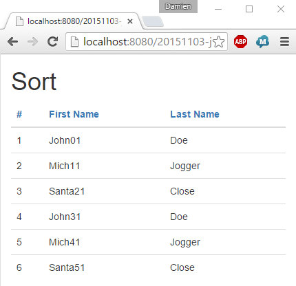
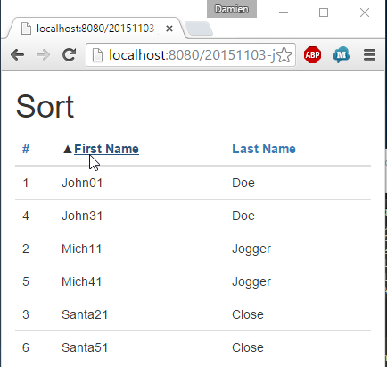
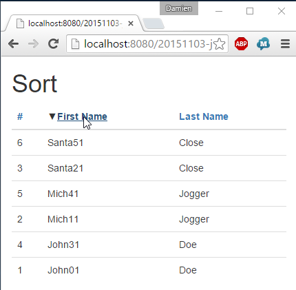
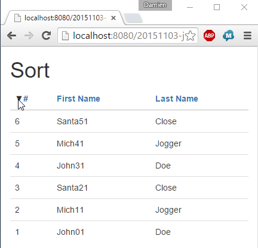

JavaEE AngularJS Bootstrap: How to Sort with Smart-Table
======
 

 
Here is a sortable data-table. Using Twitter Bootstrap,  ng-module SmartTable for front-end. And Spring-Data, Jersey JAXRS for backend.
 
# Demo
 
Start with Tomcat:
 
[http://localhost:8080/20151103-javaee-angularjs-bootstrap-sort/](http://localhost:8080/20151103-javaee-angularjs-bootstrap-sort/)
http://localhost:8080/20151103-javaee-angularjs-bootstrap-sort/
 
A data-table is displayed, with rows and sorter headers.
 

 

 
By clicking on row’s header, the row’s data order change and a new icon is displayed.
 

 

 
It’s possible to reverse the order.
 

 

 
It work with both String and Nubmer type (see Java code).
 

 

 
# Source
 

 

 
DatasRepository.java
 
```java
package com.damienfremont.blog;
 
import static org.springframework.data.domain.Sort.Direction.ASC;
 
import java.io.Serializable;
import java.util.ArrayList;
import java.util.List;
 
import org.springframework.data.domain.Page;
import org.springframework.data.domain.PageImpl;
import org.springframework.data.domain.Pageable;
import org.springframework.data.domain.Sort;
import org.springframework.data.domain.Sort.Order;
import org.springframework.data.repository.PagingAndSortingRepository;
 
import com.damienfremont.blog.ServiceJAXRS.Person;
import com.google.common.base.Function;
import com.google.common.collect.Ordering;
 
public class DatasRepository implements PagingAndSortingRepository<Person, Serializable> {
 
  // MOCK
  static List<Person> datas;
  static {
    datas = new ArrayList<>();
    for (int i = 0; i < 5; i++) {
      datas.add(new Person(i + 1, "John" + i + 1, "Doe"));
      i++;
      datas.add(new Person(i + 1, "Mich" + i + 1, "Jogger"));
      i++;
      datas.add(new Person(i + 1, "Santa" + i + 1, "Close"));
    }
  }
 
  @Override
  public Page<Person> findAll(Pageable arg0) {
    List<Person> content = null;
    if (null != arg0.getSort()) {
      Order orderById = arg0.getSort().getOrderFor("id");
      Order orderByLastName = arg0.getSort().getOrderFor("lastName");
      Order orderByFirstName = arg0.getSort().getOrderFor("firstName");
      Order order = null;
      Function sortBy = null;
      if (orderById != null) {
        order = orderById;
        sortBy = sortById;
      } else if (orderByLastName != null) {
        order = orderByLastName;
        sortBy = sortByLastName;
      } else if (orderByFirstName != null) {
        order = orderByFirstName;
        sortBy = sortByFirstName;
      } else {
        order = new Order(ASC, "id");
        sortBy = sortById;
      }
      Ordering ordering = Ordering //
          .natural() //
          .onResultOf(sortBy);
      boolean isOrderAsc = (order.getDirection() == ASC);
      content = isOrderAsc //
          ? ordering.sortedCopy(datas) //
          : ordering.reverse().sortedCopy(datas);
    } else {
      content = new ArrayList<>(datas);
    }
    int total = datas.size();
    return new PageImpl<>(content, arg0, total);
  }
 
  Function<Person, Integer> sortById = new Function<Person, Integer>() {
    public Integer apply(Person foo) {
      return foo.id;
    }
  };
 
  Function<Person, String> sortByFirstName = new Function<Person, String>() {
    public String apply(Person foo) {
      return foo.firstName;
    }
  };
 
  Function<Person, String> sortByLastName = new Function<Person, String>() {
    public String apply(Person foo) {
      return foo.lastName;
    }
  };
...
```
 
MyAppCONFIG.java
 
```java
package com.damienfremont.blog;
 
import java.util.HashSet;
import java.util.Set;
import javax.ws.rs.core.Application;
 
public class MyAppCONFIG extends Application {
 
  @Override
  public Set<Class<?>> getClasses() {
    Set<Class<?>> s = new HashSet<Class<?>>();
    s.add(ServiceJAXRS.class);
    return s;
  }
}
```
 
ServiceJAXRS.java
 
```java
package com.damienfremont.blog;
 
import static org.springframework.data.domain.Sort.Direction.ASC;
import static org.springframework.data.domain.Sort.Direction.DESC;
 
import java.io.Serializable;
 
import javax.ws.rs.GET;
import javax.ws.rs.Path;
import javax.ws.rs.Produces;
import javax.ws.rs.QueryParam;
import javax.ws.rs.core.MediaType;
 
import org.springframework.data.domain.Page;
import org.springframework.data.domain.PageRequest;
import org.springframework.data.domain.Pageable;
import org.springframework.data.domain.Sort;
import org.springframework.data.domain.Sort.Direction;
 
@Path("/person")
public class ServiceJAXRS {
 
  DatasRepository datas = new DatasRepository();
 
  @Path("/page")
  @GET
  @Produces(MediaType.APPLICATION_JSON)
  public Page<Person> getAll( //
      @QueryParam("sort") String sortPredicate, //
      @QueryParam("reverse") Boolean sortReverse //
  ) {
    Direction order = sortReverse ? DESC : ASC;
    Sort sort = new Sort(order, sortPredicate);
    Pageable pageRequest = new PageRequest(0, 100, sort);
    Page<Person> page = datas.findAll(pageRequest);
    return page;
  }
 
  // MODEL
  static class Person implements Serializable {
    private static final long serialVersionUID = 9167120287441116359L;
    public Integer id;
    public String firstName;
    public String lastName;
 
    public Person() { }
 
    public Person(Integer id, String firstName, String lastName) {
      super();
      this.id = id;
      this.firstName = firstName;
      this.lastName = lastName;
    }
  }
 
}
```
 
web.xml
 
```xml
<web-app xmlns="http://xmlns.jcp.org/xml/ns/javaee" xmlns:xsi="http://www.w3.org/2001/XMLSchema-instance"
    xsi:schemaLocation="http://xmlns.jcp.org/xml/ns/javaee
     http://xmlns.jcp.org/xml/ns/javaee/web-app_3_1.xsd"
    version="3.1">
 
    <servlet>
        <servlet-name>REST</servlet-name>
        <servlet-class>org.glassfish.jersey.servlet.ServletContainer</servlet-class>
        <init-param>
            <param-name>javax.ws.rs.Application</param-name>
            <param-value>com.damienfremont.blog.MyAppCONFIG</param-value>
        </init-param>
        <init-param>
            <param-name>jersey.config.server.provider.classnames</param-name>
            <param-value>org.glassfish.jersey.media.multipart.MultiPartFeature</param-value>
        </init-param>
        <load-on-startup>1</load-on-startup>
    </servlet>
    <servlet-mapping>
        <servlet-name>REST</servlet-name>
        <url-pattern>/api/*</url-pattern>
    </servlet-mapping>
 
    <servlet>
        <servlet-name>WEBJARS</servlet-name>
        <servlet-class>org.webjars.servlet.WebjarsServlet</servlet-class>
        <init-param>
            <param-name>disableCache</param-name>
            <param-value>true</param-value>
        </init-param>
        <load-on-startup>2</load-on-startup>
    </servlet>
    <servlet-mapping>
        <servlet-name>WEBJARS</servlet-name>
        <url-pattern>/webjars/*</url-pattern>
    </servlet-mapping>
 
</web-app>
```
 
app.js
 
```javascript
'use strict';
 
var app = angular.module(
  'app',
  [ 'ngResource',
    'smart-table'
    ]);
 
app.factory('Service', function($resource) {
    return $resource('api/person/page');
});
 
app.controller('TableCtrl', function ($scope, Service) {
     
  $scope.callServer = function(tableState) {
    var sort = tableState.sort;
    var predicate = sort.predicate || 'id';
    var reverse = sort.reverse || false;
    Service.get({
        sort : predicate,
        reverse : reverse
      },
      function(pageable) {
        $scope.items = pageable.content;
    });
  };
});
```
 
index.jsp
 
```xml
<!DOCTYPE html>
<html
  ng-app="app">
<head>
<!-- LIBS CSS -->
<link rel="stylesheet" href="webjars/bootstrap/${bootstrap.version}/css/bootstrap.css">
<link rel="stylesheet" href="style.css">
<!-- LIBS JS -->
<script src="webjars/angularjs/${angularjs.version}/angular.js"></script>
<script src="webjars/angularjs/${angularjs.version}/angular-resource.js"></script>
<script src="webjars/angular-smart-table/${angular-smart-table.version}/dist/smart-table.js"></script>
<!-- YOUR JS -->
<script src="app.js"></script>
</head>
<body>
<div class="container">
 
<h1>Sort</h1>
<form
  ng-controller="TableCtrl">
<table class="table"
  st-table="items"
  st-pipe="callServer">
<thead>
     
<!-- HEADERS -->
<tr>
  <th st-sort="id">
    <a href="#">#</a></th>
  <th st-sort="firstName">
    <a href="#">First Name</a></th>
  <th st-sort="lastName">
    <a href="#">Last Name</a></th>
</tr>
</thead>
 
<!-- CONTENT -->
<tbody>
<tr ng-repeat="i in items">
  <td>{{i.id}}</td>
  <td>{{i.firstName}}</td>
  <td>{{i.lastName}}</td>
</tr>
</tbody>
 
</table>
</form>   
</div>
</body>
</html>
```
 
style.css
 
```css
.st-sort-ascent:before {
  content: '\25B2';
}
.st-sort-descent:before {
  content: '\25BC';
}
```
 
# Project
 
[https://github.com/DamienFremont/blog/tree/master/20151103-javaee-angularjs-bootstrap-sort](https://github.com/DamienFremont/blog/tree/master/20151103-javaee-angularjs-bootstrap-sort)
https://github.com/DamienFremont/blog/tree/master/20151103-javaee-angularjs-bootstrap-sort
 
# References
 
[http://projects.spring.io/spring-data/](http://projects.spring.io/spring-data/)
http://projects.spring.io/spring-data/
 
[http://ngmodules.org/modules/Smart-Table](http://ngmodules.org/modules/Smart-Table)
http://ngmodules.org/modules/Smart-Table
 
[http://lorenzofox3.github.io/smart-table-website/](http://lorenzofox3.github.io/smart-table-website/)
http://lorenzofox3.github.io/smart-table-website/
 
 
[https://damienfremont.com/2015/11/03/javaee-angularjs-bootstrap-how-to-sort-with-smart-table/](https://damienfremont.com/2015/11/03/javaee-angularjs-bootstrap-how-to-sort-with-smart-table/)
 
