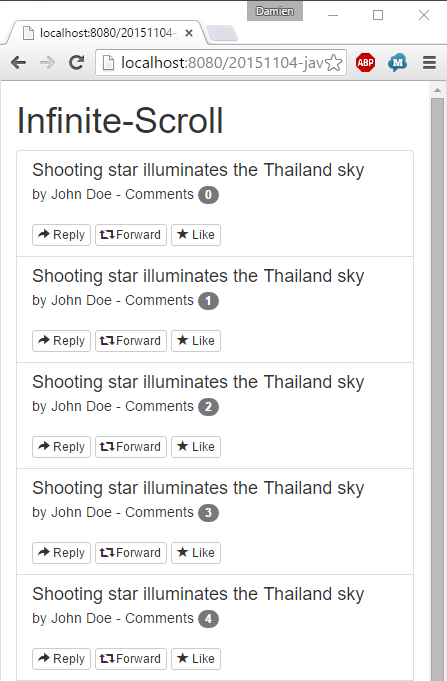
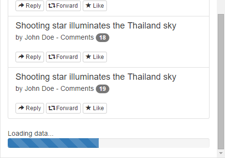

JavaEE AngularJS Bootstrap: How to Infinite-Scroll
======
 

 

 
A simple infinite scroll like Twitter or Facebook’s timelines. You’ll never reach the footer!
 
# Demo
 
Start with Tomcat:
 
[http://localhost:8080/20151104-javaee-angularjs-bootstrap-infinite_scroll/](http://localhost:8080/20151104-javaee-angularjs-bootstrap-infinite_scroll/)
http://localhost:8080/20151104-javaee-angularjs-bootstrap-infinite_scroll/
 
A simple timeline with Bootstrap components.
 
You can scroll to the end.
 

 

 
And there is loading alert and animated progress bar.
 

 

 
After loading, the new content is displayed.
 
You can do infinite scroll now.
 

 

 
# Source
 

 

 
DatasRepository.java
 
```java
package com.damienfremont.blog;
 
import java.io.Serializable;
import java.util.ArrayList;
import java.util.List;
 
import org.springframework.data.domain.Page;
import org.springframework.data.domain.PageImpl;
import org.springframework.data.domain.Pageable;
import org.springframework.data.domain.Sort;
import org.springframework.data.repository.PagingAndSortingRepository;
 
import com.damienfremont.blog.ServiceJAXRS.Message;
 
public class DatasRepository implements PagingAndSortingRepository<Message, Serializable> {
 
  // MOCK
  static List<Message> datas;
  static {
    datas = new ArrayList<>();
    for (int i = 0; i < 5000; i++) {
      datas.add(new Message(i, "Shooting star illuminates the Thailand sky", "John Doe", i));
    }
  }
 
  @Override
  public Page<Message> findAll(Pageable arg0) {
    int pSize = arg0.getPageSize();
    int pNumb = arg0.getPageNumber();
    int pFirst = pNumb * pSize;
    int pLast = pFirst + pSize;
    int total = datas.size();
    List<Message> content = new ArrayList<>();
    for (int i = 0; i < total; i++) { if (i >= pFirst && i < pLast) {
        Message data = datas.get(i);
        content.add(data);
      }
    }
    return new PageImpl<>(content, arg0, total);
  }
 
  ...
}
```
 
MyAppCONFIG.java
 
```java
package com.damienfremont.blog;
 
import java.util.HashSet;
import java.util.Set;
import javax.ws.rs.core.Application;
 
public class MyAppCONFIG extends Application {
 
  @Override
  public Set<Class<?>> getClasses() {
    Set<Class<?>> s = new HashSet<Class<?>>();
    s.add(ServiceJAXRS.class);
    return s;
  }
}
```
 
ServiceJAXRS.java
 
```java
package com.damienfremont.blog;
 
import java.io.Serializable;
 
import javax.ws.rs.GET;
import javax.ws.rs.Path;
import javax.ws.rs.Produces;
import javax.ws.rs.QueryParam;
import javax.ws.rs.core.MediaType;
 
import org.springframework.data.domain.Page;
import org.springframework.data.domain.PageRequest;
import org.springframework.data.domain.Pageable;
 
 
@Path("/message")
public class ServiceJAXRS {
 
  DatasRepository datas = new DatasRepository();
 
  @Path("/page")
  @GET
  @Produces(MediaType.APPLICATION_JSON)
  public Page<Message> getAll( //
      @QueryParam("page") Integer page, //
      @QueryParam("size") Integer size) {
    Pageable pageRequest = new PageRequest( //
        ((page == null) ? 0 : (page - 1)), //
        ((size == null) ? 10 : size));
    return datas.findAll(pageRequest);
  }
 
  // MODEL
  static class Message implements Serializable {
    private static final long serialVersionUID = 9167120287441116359L;
    public Integer score;
    public String title;
    public String author;
    public Integer num_comments;
 
    public Message() {
    }
 
    public Message(Integer score, String title, String author, Integer num_comments) {
      super();
      this.score = score;
      this.title = title;
      this.author = author;
      this.num_comments = num_comments;
    }
  }
}
```
 
web.xml
 
```xml
<web-app xmlns="http://xmlns.jcp.org/xml/ns/javaee" xmlns:xsi="http://www.w3.org/2001/XMLSchema-instance" xsi:schemaLocation="http://xmlns.jcp.org/xml/ns/javaee http://xmlns.jcp.org/xml/ns/javaee/web-app_3_1.xsd" version="3.1">
 
  <servlet>
    <servlet-name>REST</servlet-name>
    <servlet-class>org.glassfish.jersey.servlet.ServletContainer</servlet-class>
    <init-param>
      <param-name>javax.ws.rs.Application</param-name>
      <param-value>com.damienfremont.blog.MyAppCONFIG</param-value>
    </init-param>
    <init-param>
      <param-name>jersey.config.server.provider.classnames</param-name>
      <param-value>org.glassfish.jersey.media.multipart.MultiPartFeature</param-value>
    </init-param>
    <load-on-startup>1</load-on-startup>
  </servlet>
  <servlet-mapping>
    <servlet-name>REST</servlet-name>
    <url-pattern>/api/*</url-pattern>
  </servlet-mapping>
 
  <servlet>
    <servlet-name>WEBJARS</servlet-name>
    <servlet-class>org.webjars.servlet.WebjarsServlet</servlet-class>
    <init-param>
      <param-name>disableCache</param-name>
      <param-value>true</param-value>
    </init-param>
    <load-on-startup>2</load-on-startup>
  </servlet>
  <servlet-mapping>
    <servlet-name>WEBJARS</servlet-name>
    <url-pattern>/webjars/*</url-pattern>
  </servlet-mapping>
 
</web-app>
```
 
app.js
 
```javascript
'use strict';
 
var app = angular.module(
  'app',
  [ 'ngResource',
    'infinite-scroll'
    ]);
 
app.factory('Service', function($resource) {
    return $resource('api/message/page');
});
 
app.controller('MainCtrl', function ($scope, Service) {
  const itemsByPage = 10;
  var lastStart = 0;
  $scope.items = [];
  $scope.busy = false;
 
  // GET PAGE
  function getAPage(start, number) {
    $scope.busy = true;
  Service.get({
    page : 1+(start/number),
    size : number
    },
    function(pageable) {
      $scope.items = $scope.items.concat(pageable.content);
        lastStart = start+number;
        $scope.busy = false;
      });
  }
   
  // SCROLL
  $scope.addMoreItems = function() {
    getAPage(lastStart, itemsByPage);
  };
   
  // INIT
  getAPage(lastStart, 20);
});
```
 
index.jsp
 
```xml
<!DOCTYPE html>
<html ng-app="app">
<head>
<!-- LIBS CSS -->
<link rel="stylesheet" href="webjars/bootstrap/${bootstrap.version}/css/bootstrap.css">
<!-- LIBS JS -->
<script src="webjars/angularjs/${angularjs.version}/angular.js"></script>
<script src="webjars/angularjs/${angularjs.version}/angular-resource.js"></script>
<script src="webjars/ngInfiniteScroll/${ngInfiniteScroll.version}/build/ng-infinite-scroll.js"></script>
<!-- YOUR JS -->
<script src="app.js"></script>
</head>
<body ng-controller="MainCtrl">
<div class="container">
<h1>Infinite-Scroll</h1>
 
<!-- SCROLL -->
<div infinite-scroll="addMoreItems()">
     
<!-- CONTENT -->
<div class="list-group">
<div class="list-group-item" href="#" ng-repeat='i in items'>
  <h4 class="list-group-item-heading">
    {{i.title}}
  </h4>
  <p class="list-group-item-text">
    by {{i.author}} - Comments <span class="badge">{{i.num_comments}}</span>
  </p>
  <br>
    <a class="btn btn-default btn-xs" href="#">
      <span class="glyphicon glyphicon-share-alt"></span> Reply</a>
    <a class="btn btn-default btn-xs" href="#">
      <span class="glyphicon glyphicon-retweet"></span> Forward</a>    
    <a class="btn btn-default btn-xs" href="#">
      <span class="glyphicon glyphicon-star"></span> Like</a>
</div>
</div>
</div>
 
<!-- LOADING -->
<div ng-show='busy'>
  Loading data...
  <div class="progress">
  <div class="progress-bar progress-bar-striped active" role="progressbar" aria-valuenow="45" aria-valuemin="0" aria-valuemax="100" style="width: 45%">
    <span class="sr-only">45% Complete</span>
  </div>
</div>
</div>
</div>
</body>
</html>
```
 
pom.xml
 
```xml
<project xmlns="http://maven.apache.org/POM/4.0.0" xmlns:xsi="http://www.w3.org/2001/XMLSchema-instance"
  xsi:schemaLocation="http://maven.apache.org/POM/4.0.0 http://maven.apache.org/xsd/maven-4.0.0.xsd">
  <modelVersion>4.0.0</modelVersion>
 
  <groupId>com.damienfremont.blog</groupId>
  <artifactId>20151104-javaee-angularjs-bootstrap-infinite_scroll</artifactId>
  <version>0.0.1-SNAPSHOT</version>
  <packaging>war</packaging>
 
  <properties>
    <project.build.sourceEncoding>UTF-8</project.build.sourceEncoding>
    <!-- JAVAEE -->
    <java.version>7</java.version>
    <javaee.version>7.0</javaee.version>
    <jersey.version>2.22.1</jersey.version>
    <!-- WEB -->
    <bootstrap.version>3.3.5</bootstrap.version>
    <angularjs.version>1.4.7</angularjs.version>
    <angular-ui-bootstrap.version>0.14.0</angular-ui-bootstrap.version>
    <ngInfiniteScroll.version>1.2.1</ngInfiniteScroll.version>
  </properties>
 
  <dependencies>
 
    <!-- JAVA -->
 
    <dependency>
      <groupId>javax</groupId>
      <artifactId>javaee-api</artifactId>
      <version>${javaee.version}</version>
      <scope>provided</scope>
    </dependency>
 
    <dependency>
      <groupId>org.glassfish.jersey.containers</groupId>
      <artifactId>jersey-container-servlet</artifactId>
      <version>${jersey.version}</version>
    </dependency>
    <dependency>
      <groupId>org.glassfish.jersey.media</groupId>
      <artifactId>jersey-media-json-jackson</artifactId>
      <version>${jersey.version}</version>
    </dependency>
 
    <dependency>
      <groupId>org.springframework.data</groupId>
      <artifactId>spring-data-commons</artifactId>
      <version>1.9.0.RELEASE</version>
    </dependency>
 
    <!-- WEB -->
 
    <dependency>
      <groupId>org.webjars</groupId>
      <artifactId>webjars-servlet-2.x</artifactId>
      <version>1.1</version>
    </dependency>
 
    <dependency>
      <groupId>org.webjars</groupId>
      <artifactId>bootstrap</artifactId>
      <version>${bootstrap.version}</version>
    </dependency>
 
    <dependency>
      <groupId>org.webjars</groupId>
      <artifactId>angularjs</artifactId>
      <version>${angularjs.version}</version>
    </dependency>
    <dependency>
      <groupId>org.webjars</groupId>
      <artifactId>angular-ui-bootstrap</artifactId>
      <version>${angular-ui-bootstrap.version}</version>
    </dependency>
    <dependency>
      <groupId>org.webjars.bower</groupId>
      <artifactId>ngInfiniteScroll</artifactId>
      <version>${ngInfiniteScroll.version}</version>
    </dependency>
 
  </dependencies>
  <build>
    <resources>
      <resource>
        <directory>src/main/webapp</directory>
        <filtering>true</filtering>
        <targetPath>${project.basedir}/target/m2e-wtp/web-resources</targetPath>
        <includes>
          <include>*.jsp</include>
        </includes>
      </resource>
    </resources>
    <plugins>
      <plugin>
        <groupId>org.apache.maven.plugins</groupId>
        <artifactId>maven-war-plugin</artifactId>
        <version>2.6</version>
        <configuration>
          <webResources>
            <resource>
              <directory>src/main/webapp</directory>
              <filtering>true</filtering>
              <includes>
                <include>*.jsp</include>
              </includes>
            </resource>
          </webResources>
        </configuration>
      </plugin>
      <plugin>
        <groupId>org.apache.maven.plugins</groupId>
        <artifactId>maven-compiler-plugin</artifactId>
        <version>3.1</version>
        <configuration>
          <source>1.${java.version}</source>
          <target>1.${java.version}</target>
        </configuration>
      </plugin>
    </plugins>
  </build>
</project>
```
 
# Project
 
[https://github.com/DamienFremont/blog/tree/master/20151104-javaee-angularjs-bootstrap-infinite_scroll](https://github.com/DamienFremont/blog/tree/master/20151104-javaee-angularjs-bootstrap-infinite_scroll)
https://github.com/DamienFremont/blog/tree/master/20151104-javaee-angularjs-bootstrap-infinite_scroll
 
# References
 
[https://github.com/sroze/ngInfiniteScroll](https://github.com/sroze/ngInfiniteScroll)
https://github.com/sroze/ngInfiniteScroll
 
[http://getbootstrap.com/components/#btn-groups-single](http://getbootstrap.com/components/#btn-groups-single)
http://getbootstrap.com/components/#btn-groups-single
 
 
## Origin
[https://damienfremont.com/2015/11/04/javaee-angularjs-bootstrap-how-to-infinite-scroll/](https://damienfremont.com/2015/11/04/javaee-angularjs-bootstrap-how-to-infinite-scroll/)
 
