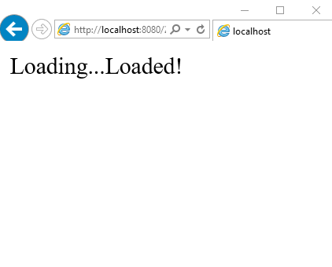
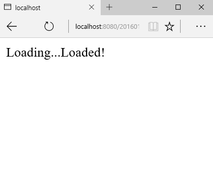
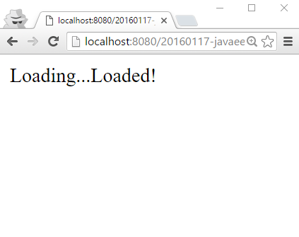
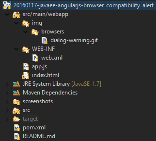

JavaEE AngularJs: Browser Compatibility Alert
======
 

 
An example of alert in case of client side incompatible browser, like IE8. On others browsers like Chrome, FF or Safari, it will not popup.
 

 
## Demo
 
On IE11 Browser.
 

 

 
Now change your compatibility to IE8 after F12.
 

 

 
On IE8 Browser.
 

 

 
On Edge Browser.
 

 

 
On Chrome Browser.
 

 

 
## Source
 

 

 
 
 
pom.xml
 
```xml
<project xmlns="http://maven.apache.org/POM/4.0.0" xmlns:xsi="http://www.w3.org/2001/XMLSchema-instance"
  xsi:schemaLocation="http://maven.apache.org/POM/4.0.0 http://maven.apache.org/xsd/maven-4.0.0.xsd">
  <modelVersion>4.0.0</modelVersion>
  <groupId>com.damienfremont.blog</groupId>
  <artifactId>20160117-javaee-angularjs-browser_compatibility_alert</artifactId>
  <version>0.0.1-SNAPSHOT</version> 
  <packaging>war</packaging>
  <properties>
    <project.build.sourceEncoding>UTF-8</project.build.sourceEncoding>
    <java.version>7</java.version>
    <angularjs.version>1.4.7</angularjs.version>
  </properties>
  <dependencies>
    <dependency>
      <groupId>org.webjars</groupId>
      <artifactId>webjars-servlet-2.x</artifactId>
      <version>1.1</version>
    </dependency>
    <dependency>
      <groupId>org.webjars</groupId>
      <artifactId>angularjs</artifactId>
      <version>${angularjs.version}</version>
    </dependency>
  </dependencies>
  <build>
    <resources>
      <resource>
        <directory>src/main/webapp</directory>
        <filtering>true</filtering>
        <targetPath>${project.basedir}/target/m2e-wtp/web-resources</targetPath>
        <includes>
          <include>index.html</include>
        </includes>
      </resource>
    </resources> 
    <plugins>
      <plugin>
        <groupId>org.apache.maven.plugins</groupId>
        <artifactId>maven-war-plugin</artifactId>
        <configuration>
          <webResources>
            <resource>
              <directory>src/main/webapp</directory>
              <filtering>true</filtering>
              <includes>
                <include>app.js</include>
                <include>index.html</include>
              </includes>
            </resource>
          </webResources>
        </configuration>
      </plugin>
      <plugin>
        <groupId>org.apache.maven.plugins</groupId>
        <artifactId>maven-compiler-plugin</artifactId>
        <version>3.1</version>
        <configuration>
          <source>1.${java.version}</source>
          <target>1.${java.version}</target>
        </configuration>
      </plugin>
    </plugins>
  </build>
</project>
```
 
app.js
 
```javascript
'use strict';
 
angular.module('app', []);
 
angular.module('app')
.controller('ExampleCtrl', function($scope) {
    $scope.message = 'Loaded!';
});
```
 
index.html
 
```xml
<!DOCTYPE html>
<html ng-app="app">
<head>
<meta charset="utf-8">
 
<!-- YOUR CSS -->
<!--[if gte IE 9]>
  <link rel="stylesheet" href="css/main.css?version=${project.version}">
<![endif]-->
</head>
<body>
 
<!-- BROWSER COMPATIBILITY ALERT -->
<!--[if lte IE 8]>
<style type="text/css">
.ie8-alert {
  padding-top: 20%;
  padding: 20%;
  background-color: #FDF2AB;
  height: 100%;
  widht: 100%;
  margin: 0px;
}
.ie8-alert a {
  color: #fff;
  background-color: #0370ea;
  font-size: 13px;
  font-weight: 700;
  line-height: 1.3;
  display: inline-block;
  padding: 6px 12px;
  margin: 6px 12px;
}
</style>
<div class="ie8-alert"">
  <p>
    
    Your browser (Internet Explorer 8) is out of date.
    It has known security flaws and may not display all
    features of this and other websites.
    <strong>Please use another Internet Browser like Firefox, Chrome or InternetExplorer10</strong>.
  </p>
  <p>
    <a href="https://browser-update.org/en/update.html">
      Learn how to update your browser
    </a>
  </p>
</div>
<![endif]-->
 
<!-- YOUR PAGE AND JS 2nd -->
<!--[if IE]><![if gte IE 9]><![endif]-->
 
  <div ng-controller="ExampleCtrl">
    Loading...{{message}}
  </div>
 
  <script src="webjars/angularjs/${angularjs.version}/angular.js"></script>
  <script src="app.js?version=${project.version}"></script>
<!--[if IE]><![endif]><![endif]-->
</body>
</html>
```
 
web.xml
 
```xml
<web-app xmlns="http://xmlns.jcp.org/xml/ns/javaee"
         xmlns:xsi="http://www.w3.org/2001/XMLSchema-instance"
         xsi:schemaLocation="http://xmlns.jcp.org/xml/ns/javaee
     http://xmlns.jcp.org/xml/ns/javaee/web-app_3_1.xsd"
         version="3.1">
   
  <servlet>
    <servlet-name>WEBJARS</servlet-name>
    <servlet-class>org.webjars.servlet.WebjarsServlet</servlet-class>
    <init-param>
      <param-name>disableCache</param-name>
      <param-value>true</param-value>
    </init-param>
    <load-on-startup>2</load-on-startup>
  </servlet>
  <servlet-mapping>
    <servlet-name>WEBJARS</servlet-name>
    <url-pattern>/webjars/*</url-pattern>
  </servlet-mapping>
 
</web-app>
```
 
## Project
 
[https://github.com/DamienFremont/blog/tree/master/20160117-javaee-angularjs-browser_compatibility_alert](https://github.com/DamienFremont/blog/tree/master/20160117-javaee-angularjs-browser_compatibility_alert)
https://github.com/DamienFremont/blog/tree/master/20160117-javaee-angularjs-browser_compatibility_alert
 
## References
 
[http://www.impressivewebs.com/conditional-comments/](http://www.impressivewebs.com/conditional-comments/)
http://www.impressivewebs.com/conditional-comments/
 
 
## Origin
[https://damienfremont.com/2016/01/17/javaee-angularjs-browser-compatibility-alert/](https://damienfremont.com/2016/01/17/javaee-angularjs-browser-compatibility-alert/)
 
